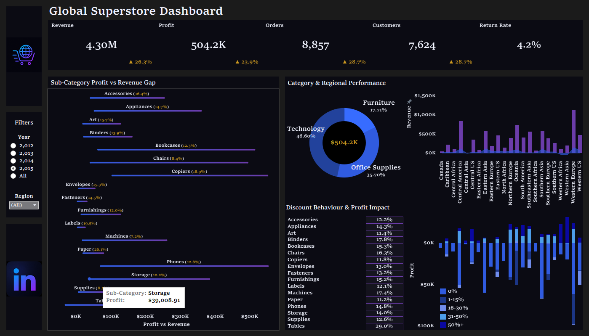

# Global Superstore Profitability Analysis

## Problem Statement

Global Superstore shows strong sales activity across regions, categories, and customer segments, but revenue alone does not determine business health.

A business can generate high sales while still facing profitability challenges caused by low margins, broad discounting, or return-heavy areas. If stakeholders only focus on sales totals, they may miss where the business is losing efficiency or where revenue is not translating into sustainable profit.

This project analyzes sales, profit, discount behavior, returns, and performance differences across the business to identify where strong revenue may be masking weaker outcomes.

**Central question:**  
Where is the business generating sales without protecting profitability?

---

## Project Summary

This analysis evaluates Global Superstore performance through the lens of profitability, discount strategy, and return risk. The final dashboard was built to help stakeholders compare sales against profit, identify low-margin categories, and recognize where discounting may be weakening business performance.

The strongest finding is that **profit loss becomes more visible when discounts reach 30% or higher**, especially within the **Tables** sub-category. Tables produce the lowest overall profit and are often discounted near the same threshold where profitability begins to break down.

---

## Key Findings

- **Profit loss becomes more visible at 30% discounts or higher.** This suggests a potential discount threshold where promotions begin to weaken margin.
- **Tables produce the lowest overall profit.** This sub-category should be reviewed separately from Furniture because its performance is pulling down profitability.
- **Tables are commonly discounted around the 30% mark.** A low-profit product group being discounted near a risky threshold creates a compounding profitability issue.
- **Sales alone can create a misleading view of performance.** Revenue needs to be reviewed alongside profit, margin, returns, and discount behavior.

---

## Recommendations

- Review discount policies at or above the 30% threshold.
- Investigate the Tables sub-category separately to understand whether pricing, cost, or discounting strategy is driving weak profit.
- Monitor sales, profit, margin, returns, and discount levels together instead of evaluating revenue alone.
- Use the dashboard as a recurring performance review tool to identify where revenue is not converting into sustainable profit.

---

## Dashboard

The Tableau dashboard highlights KPI performance, category and regional trends, return behavior, and discount impact.

---

## Repository Structure

- [Supporting Work](./supporting_work/) — data quality checks, metric definitions, and SQL preparation
- [Analysis](./analysis/) — key findings and recommendations
- [Dashboard](./visuals/) — final Tableau dashboard output

---

## Dataset

The project uses the Global Superstore dataset from Kaggle.

The dataset includes:

- **Orders** — transaction-level sales, profit, discount, and customer data
- **Returns** — order-level return indicators
- **People** — regional assignment information

These tables were joined and transformed into an analysis-ready structure for KPI reporting and profitability analysis.

---

## Tools Used

- **SQL / BigQuery** — data validation, transformation, and KPI calculations
- **Tableau** — dashboard design and visual analysis
- **GitHub** — project documentation and version control
